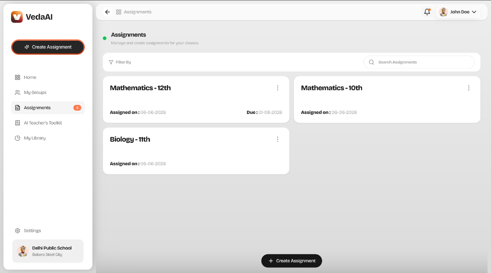
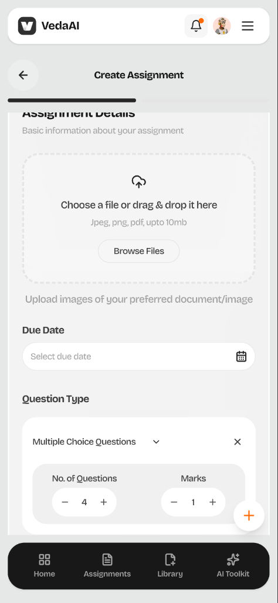
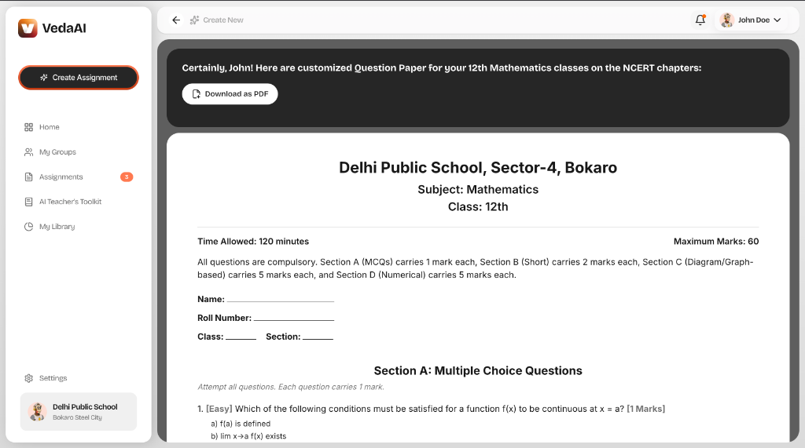

# VedaAI

An AI-powered assessment creation tool for school teachers. Upload study material, configure a question rubric, and generate a complete, structured question paper using Google Gemini — with real-time progress updates and PDF export.


---

## Screenshots

| Assignments Dashboard | Create Assignment | Generated Output |
|---|---|---|
|  |  |  |

---

## Features

- Upload reference materials (PDFs, images) via drag-and-drop
- Configure question types, count, and marks per question
- AI-generated structured question paper with sections, difficulty levels, and answer key
- Real-time generation progress via WebSocket (with polling fallback)
- Formatted output page with school info, student fields, and printable layout
- PDF export via browser print
- Regenerate with same settings or edit and regenerate
- Voice-to-text input for additional instructions
- Assignments persisted to localStorage and displayed on dashboard
- Fully responsive — mobile bottom nav, adaptive layouts

---

## Tech Stack

| Layer | Technology |
|---|---|
| Frontend | Next.js 16, React 19, TypeScript, Tailwind CSS v4 |
| State | Zustand |
| Animations | Framer Motion |
| UI Components | shadcn/ui |
| Backend | Node.js, Express, TypeScript |
| Database | MongoDB (Mongoose) |
| Queue | Redis + BullMQ |
| Realtime | Socket.IO |
| AI | Google Gemini API |
| Speech-to-Text | Groq Whisper API |
| Monorepo | pnpm workspaces |

---

## Architecture

```
Frontend (Next.js)
  │
  ├── REST API ──► POST /api/assignments
  │                    │
  │                    ├── MongoDB (save assignment + files)
  │                    └── BullMQ Queue (add job)
  │                              │
  │                              ▼
  │                        Worker Process
  │                              │
  │                              ├── Gemini API (generate questions)
  │                              ├── MongoDB (save generated paper)
  │                              └── Socket.IO (notify frontend)
  │
  └── Socket.IO ◄── Real-time status updates
```

---

## Project Structure

```
veda-ai/
├── frontend/                  # Next.js application
│   ├── app/                   # App Router pages
│   ├── components/            # UI components
│   ├── lib/                   # API client, stores, hooks
│   └── public/                # Static assets
│
├── backend/                   # Express API server
│   └── src/
│       ├── routes/            # REST endpoints
│       ├── models/            # Mongoose schemas
│       ├── workers/           # BullMQ generation worker
│       ├── lib/               # DB, Redis, Gemini clients
│       └── websocket/         # Socket.IO setup
│
└── package.json               # Root monorepo config
```

---

## Setup

### Prerequisites

- Node.js 18+
- pnpm

### Install

```bash
git clone https://github.com/ishaan262004/AI-assessment-Creator-Assignment-.git
cd veda-ai
pnpm install
```

### Environment Variables

**Backend** — `backend/.env`:

```env
PORT=5001
MONGODB_URI=<mongodb_connection_string>
REDIS_URL=<redis_url>
GEMINI_API_KEY=<gemini_api_key>
CORS_ORIGIN=http://localhost:2026
```

**Frontend** — `frontend/.env.local`:

```env
NEXT_PUBLIC_API_URL=http://localhost:5001/api
GROQ_API_KEY=<groq_api_key>
```

### Run

```bash
pnpm dev:backend    # Starts backend on port 5001
pnpm dev:frontend   # Starts frontend on port 2026
```

---

## AI Generation Flow

When a teacher submits an assignment, the backend saves the uploaded files to MongoDB and adds a job to a BullMQ queue backed by Redis. A background worker picks up the job, sends the files and a structured prompt to Google Gemini's multimodal API, and parses the JSON response into a structured question paper. The result is saved to MongoDB and a Socket.IO event notifies the frontend, which renders the formatted paper immediately.

The frontend also polls every 5 seconds as a fallback in case the WebSocket event is missed.

---

## API

| Method | Endpoint | Description |
|---|---|---|
| `POST` | `/api/assignments` | Create assignment (multipart form) |
| `GET` | `/api/assignments/:id` | Get assignment by ID |
| `GET` | `/api/health` | Health check |

**WebSocket:** `assignment:{id}` — server pushes status updates (`processing`, `completed`, `failed`).

---

## Deployment

| Service | Platform |
|---|---|
| Frontend | Vercel |
| Backend | Render |
| Database | MongoDB Atlas |
| Cache/Queue | Upstash Redis |

---

## Future Improvements

- Dedicated PDF export (server-side rendering instead of browser print)
- User authentication and multi-teacher support
- Question bank and paper history
- Finer prompt controls (bloom's taxonomy, chapter-specific weighting)
- Batch grading of student submissions
